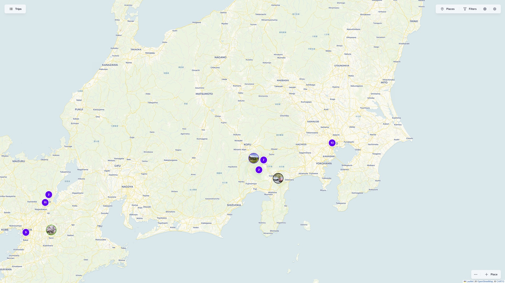
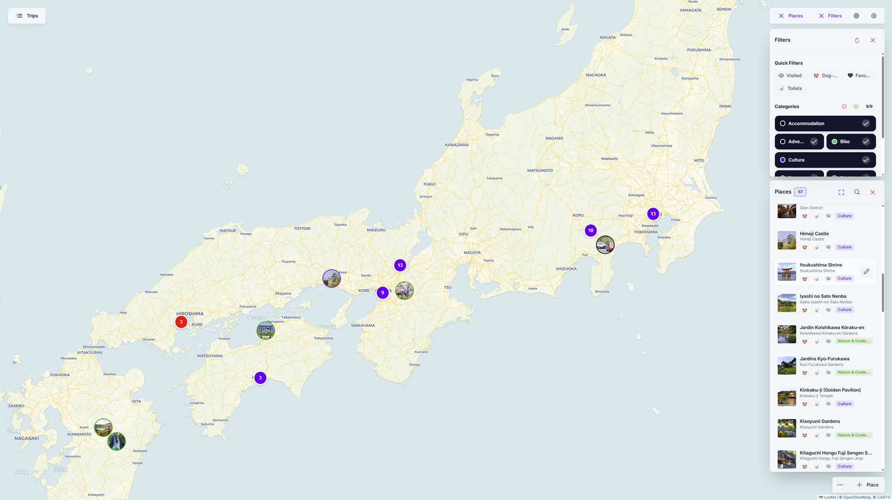
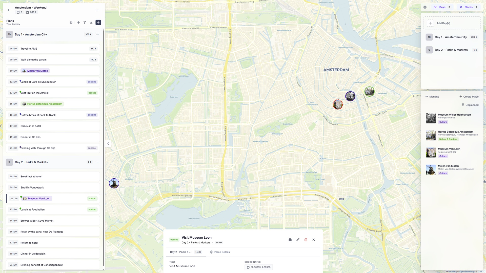
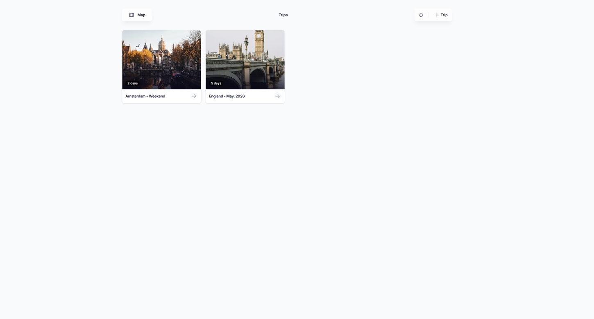

<p align="center"></p>
<h2 align="center">TRIP</h2>

<div align="center">

[](https://ko-fi.com/itskovacs)

[](https://github.com/itskovacs/trip/issues)


</div>

<p align="center">🗺️ Tourism and Recreational Interest Points</p>
<br>

<div align="center">


</div>

## 📝 Table of Contents

- 📦 [About](#about)
- 🌱 [Getting Started](#getting_started)
- 📸 [Demo](#demo)
- 🤝 [Contributing](#contributing)
- 📜 [License](#license)
- 🛠️ [Tech Stack](#techstack)

## 📦 About <a name = "about"></a>

TRIP is a self-hostable **minimalist Map tracker** and **Trip planner** to visualize your points of interest (POI) and organize your next adventure details.

**Core Features:**
- Map and manage POIs on interactive maps
- Plan multi-day trips with detailed itineraries
- Collaborate and share with travel companions

No telemetry. No tracking. No ads. Free, forever.

See the [📸 demo](#demo) to explore TRIP in action.

<br>

## 🌱 Getting Started <a name = "getting_started"></a>

If you need help, feel free to open a [discussion](https://github.com/itskovacs/trip/discussions).

Deployment is designed to be simple using Docker.

### Option 1: Docker Compose (Recommended)

Use the `docker-compose.yml` file provided in this repository. No changes are required, though you may customize it to suit your needs.

Run the container:

```bash
docker-compose up -d
```

### Option 2: Docker Run

```bash
# Ensure you have the latest image
docker pull ghcr.io/itskovacs/trip:1

# Run the container
docker run -d -p 8080:8000 -v ./storage:/app/storage ghcr.io/itskovacs/trip:1
```

### Configuration

Refer to the [configuration documentation](https://itskovacs.github.io/trip/docs/getting-started/configuration) to set up OIDC authentication and other settings.

> [!TIP]
> See [Documentation](https://itskovacs.github.io/trip/docs/intro) to learn more.

<br>

## 📸 Demo <a name = "demo"></a>

A demo is available at [itskovacs-trip.netlify.app](https://itskovacs-trip.netlify.app/).

<div align="center">

|         |         |
|:-------:|:-------:|
|  |  |
|  |  |

</div>

<br>

## 🤝 Contributing <a name = "contributing"></a>

Contributions are welcome! See [CONTRIBUTING.md](https://github.com/itskovacs/trip/blob/main/CONTRIBUTING.md) for details.

Love using TRIP? Support the project and its development by [☕ buying me a coffee](https://ko-fi.com/itskovacs).

<br>

## 📜 License <a name = "license"></a>

~~TRIP is licensed under the **CC-BY-NC-4.0**. You may use, modify, and share freely with attribution, but **commercial use is strictly prohibited**.~~

In the spirit of free and open-source software, TRIP is now licensed under the MIT License to make it easier to use, modify, and share.

<br>

## 🛠️ Tech Stack <a name = "techstack"></a>

### **Frontend**

- 🅰️ Angular 21
- 🏗️ PrimeNG 21
- 🎨 Tailwind CSS 4
- 🗺️ Leaflet 1.9 (plugins: [Leaflet.markercluster](https://github.com/Leaflet/Leaflet.markercluster), [Leaflet.contextmenu](https://github.com/aratcliffe/Leaflet.contextmenu))

### **Backend**

- 🐍 FastAPI, SQLModel
- 🗃️ SQLite

<br>


<div align="center">

If you like TRIP, consider giving it a ⭐ for visibility!  
Made with ❤️ in BZH  

<a href='https://ko-fi.com/itskovacs' target='_blank'></a>  
</div>
